## Diagrama de Flujo (Flowchart)

El siguiente diagrama muestra cómo se conectan todos los módulos del sistema: el cliente React en el navegador, la API REST en PHP, la base de datos MySQL, el sistema de archivos de medios y el sitio de documentación.

```mermaid
flowchart TD

subgraph group_client["Cliente React"]
  node_src_main(("Entrada de la app<br/>Punto de inicio React<br/>[main.jsx]"))
  node_src_app["Enrutador principal<br/>Capa de rutas<br/>[App.jsx]"]
  node_layout["Layout compartido<br/>Estructura común<br/>[LayoutCentral.jsx]"]
  node_homepage["Página de inicio<br/>Pantalla principal<br/>[HomePage.jsx]"]
  node_member_profile["Páginas de navegación<br/>Miembros y perfiles<br/>[MiembrosPage.jsx]"]
  node_auth_views["Vistas de autenticación<br/>Login y sesión<br/>[LoginPage.jsx]"]
  node_admin_ui["Panel de administración<br/>Gestión del sistema<br/>[AdminPage.jsx]"]
  node_content_sections["Bloques de contenido<br/>Secciones de la UI<br/>[HeroBanner.jsx]"]
  node_modals_forms["Modales y formularios<br/>Interfaz interactiva"]
  node_sync(("Sincronización offline<br/>Estado PWA<br/>[useSyncStatus.jsx]"))
end

subgraph group_api["API PHP"]
  node_public_api[("API Pública<br/>Lectura de datos<br/>[home_data.php]")]
  node_auth_api[("API de Autenticación<br/>JWT y sesiones<br/>[login.php]")]
  node_admin_api[("API de Administración<br/>Gestión interna<br/>[index.php]")]
end

subgraph group_storage["Persistencia"]
  node_db[("MySQL<br/>Base de datos relacional<br/>[db.php]")]
  node_uploads["Archivos multimedia<br/>Sistema de archivos"]
end

subgraph group_docs["Documentación"]
  node_docs_site["Sitio de documentación<br/>Mintlify<br/>[index.mdx]"]
end

node_src_main -->|"inicializa"| node_src_app
node_src_app -->|"envuelve"| node_layout
node_src_app -->|"enruta"| node_homepage
node_src_app -->|"enruta"| node_member_profile
node_src_app -->|"enruta"| node_auth_views
node_src_app -->|"enruta"| node_admin_ui
node_homepage -->|"compone"| node_content_sections
node_member_profile -->|"usa"| node_modals_forms
node_auth_views -->|"usa"| node_modals_forms
node_admin_ui -->|"usa"| node_modals_forms
node_src_app -->|"consulta"| node_public_api
node_src_app -->|"muta"| node_auth_api
node_src_app -->|"administra"| node_admin_api
node_sync -.->|"reconcilia"| node_auth_api
node_public_api -->|"consulta"| node_db
node_auth_api -->|"escribe"| node_db
node_admin_api -->|"modera"| node_db
node_public_api -->|"sirve medios"| node_uploads
node_auth_api -->|"almacena medios"| node_uploads
node_admin_api -->|"gestiona medios"| node_uploads
node_docs_site -.->|"documenta"| node_public_api
node_docs_site -.->|"documenta"| node_auth_api
node_docs_site -.->|"documenta"| node_admin_api

click node_src_main "https://github.com/rjoserivera/austral_collector/blob/main/src/main.jsx"
click node_src_app "https://github.com/rjoserivera/austral_collector/blob/main/src/App.jsx"
click node_layout "https://github.com/rjoserivera/austral_collector/blob/main/src/components/LayoutCentral.jsx"
click node_homepage "https://github.com/rjoserivera/austral_collector/blob/main/src/pages/HomePage.jsx"
click node_member_profile "https://github.com/rjoserivera/austral_collector/blob/main/src/pages/MiembrosPage.jsx"
click node_auth_views "https://github.com/rjoserivera/austral_collector/blob/main/src/pages/LoginPage.jsx"
click node_admin_ui "https://github.com/rjoserivera/austral_collector/blob/main/src/pages/AdminPage.jsx"
click node_content_sections "https://github.com/rjoserivera/austral_collector/blob/main/src/components/HeroBanner.jsx"
click node_modals_forms "https://github.com/rjoserivera/austral_collector/blob/main/src/components/CreatePostModal.jsx"
click node_sync "https://github.com/rjoserivera/austral_collector/blob/main/src/hooks/useSyncStatus.jsx"
click node_public_api "https://github.com/rjoserivera/austral_collector/blob/main/api/public/home_data.php"
click node_auth_api "https://github.com/rjoserivera/austral_collector/blob/main/api/auth/login.php"
click node_admin_api "https://github.com/rjoserivera/austral_collector/blob/main/api/admin/index.php"
click node_db "https://github.com/rjoserivera/austral_collector/blob/main/api/db.php"
click node_uploads "https://github.com/rjoserivera/austral_collector/tree/main/uploads/posts"
click node_docs_site "https://github.com/rjoserivera/austral_collector/blob/main/docs/index.mdx"

classDef toneBlue fill:#dbeafe,stroke:#2563eb,stroke-width:1.5px,color:#172554
classDef toneAmber fill:#fef3c7,stroke:#d97706,stroke-width:1.5px,color:#78350f
classDef toneMint fill:#dcfce7,stroke:#16a34a,stroke-width:1.5px,color:#14532d
classDef toneRose fill:#ffe4e6,stroke:#e11d48,stroke-width:1.5px,color:#881337
class node_src_main,node_src_app,node_layout,node_homepage,node_member_profile,node_auth_views,node_admin_ui,node_content_sections,node_modals_forms,node_sync toneBlue
class node_public_api,node_auth_api,node_admin_api toneAmber
class node_db,node_uploads toneMint
class node_docs_site toneRose
```

---

## Leyenda de colores

| Color | Módulo |
|---|---|
| 🔵 Azul | Cliente React (frontend) |
| 🟡 Ámbar | API PHP (backend) |
| 🟢 Verde | Persistencia (BD y archivos) |
| 🔴 Rosa | Documentación |

---

## Descripción de los módulos

### Cliente React
| Nodo | Archivo | Función |
|---|---|---|
| Entrada de la app | `main.jsx` | Punto de inicio, monta el árbol React |
| Enrutador principal | `App.jsx` | Gestiona las rutas y el estado global de sesión |
| Layout compartido | `LayoutCentral.jsx` | Estructura común de todas las páginas |
| Página de inicio | `HomePage.jsx` | Pantalla principal con todos sus bloques |
| Páginas de navegación | `MiembrosPage.jsx` | Listado y perfiles de coleccionistas |
| Vistas de autenticación | `LoginPage.jsx` | Login y cambio de contraseña |
| Panel de administración | `AdminPage.jsx` | Gestión completa del sistema |
| Bloques de contenido | `HeroBanner.jsx` | Secciones reutilizables de la UI |
| Modales y formularios | `CreatePostModal.jsx` | Interacciones emergentes |
| Sincronización offline | `useSyncStatus.jsx` | Estado PWA y sincronización con IndexedDB |

### API PHP
| Nodo | Archivo | Función |
|---|---|---|
| API Pública | `home_data.php` | Lectura de datos sin autenticación |
| API de Autenticación | `login.php` | Login, JWT y endpoints protegidos |
| API de Administración | `admin/index.php` | Gestión interna (solo admins) |

### Persistencia
| Nodo | Descripción |
|---|---|
| MySQL | Base de datos relacional, conexión vía `db.php` |
| Archivos multimedia | Carpeta `/uploads` para imágenes de posts y galería |
